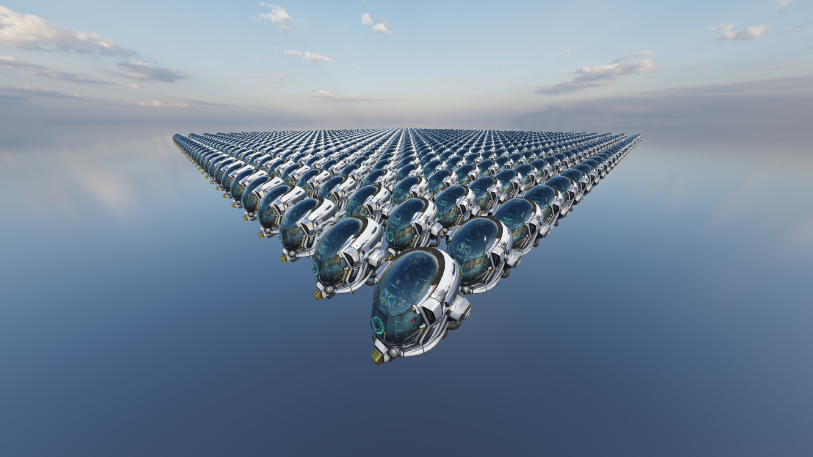

# Java OpenGL Rendering Engine
This is a real-time rendering engine made in Java using LWJGL. I created this project to learn about modern rendering techniques

## Features
- Deferred rendering pipeline
- Multi Draw Indirect (MDI) rendering
- Bindless textures
- Physically Based Rendering (PBR)
- Image Based Lighting (IBL)
- HDR rendering with ACES tonemapping
- Normal mapping with octahedral encoding
- Skybox rendering
- Cascaded shadow mapping (CSM)
- Fast Approximate Anti Aliasing (FXAA)

## Screenshots
### Damaged Helmet

### Damaged Helmets Grid


## Dependencies
- LWJGL
- OpenGL 4.6
- JOML

## Building and Running
Requirements:
- Java 8
- Maven
- OpenGL 4.6 compatible GPU

1. Clone this repository:
```bash
git clone https://github.com/pawel-janicki/java-opengl-rendering-engine.git
cd java-opengl-rendering-engine
```

2. Compile and run:
```bash
mvn compile
mvn exec:java -Dexec.mainClass="com.github.paweljanicki.game.Main"
```
